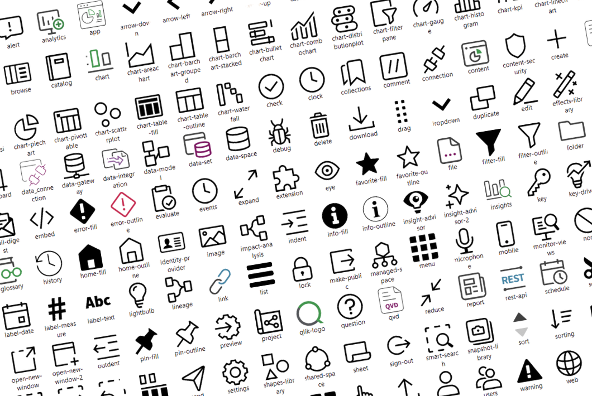
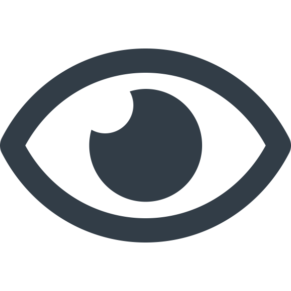
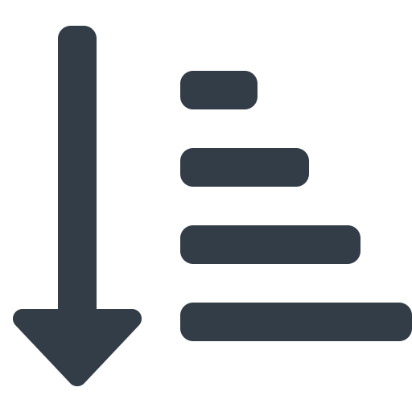

# Qlik Cloud icons
Collection of 211 Qlik Cloud icons in SVG format.

|Filename|Preview|
|---|---|
|administration.svg||
|alert.svg||
|analytics.svg||
|app.svg||
|application-automation.svg||
|arrow-down.svg||
|arrow-left.svg||
|arrow-right.svg||
|arrow-up.svg||
|assets.svg||
|assistant.svg||
|autocomplete.svg||
|automation-2.svg||
|automation.svg||
|automl-deployment.svg||
|automl-experiment.svg||
|back-2.svg||
|back.svg||
|bookmark.svg||
|browse.svg||
|catalog.svg||
|chart-areachart.svg||
|chart-barchart-grouped.svg||
|chart-barchart-stacked.svg||
|chart-bulletchart.svg||
|chart-combochart.svg||
|chart-distributionplot.svg||
|chart-filterpane.svg||
|chart-gauge.svg||
|chart-histogram.svg||
|chart-kpi.svg||
|chart-linechart.svg||
|chart-map.svg||
|chart-mekko.svg||
|chart-nlinsights.svg||
|chart-piechart.svg||
|chart-pivottable.svg||
|chart-scatterplot.svg||
|chart-table-fill.svg||
|chart-table-outline.svg||
|chart-waterfall.svg||
|chart.svg||
|check.svg||
|clock.svg||
|collections.svg||
|comment.svg||
|connection.svg||
|content-security.svg||
|content.svg||
|create.svg||
|cut.svg||
|dashboard.svg||
|data-gateway.svg||
|data-integration-2.svg||
|data-integration.svg||
|data-model.svg||
|data-set.svg||
|data-space.svg||
|data_connection.svg||
|debug.svg||
|delete.svg||
|download.svg||
|drag.svg||
|dropdown.svg||
|duplicate.svg||
|edit.svg||
|effects-library.svg||
|ellipsis.svg||
|email-digest.svg||
|email.svg||
|embed.svg||
|error-fill.svg||
|error-outline.svg||
|evaluate.svg||
|events.svg||
|expand.svg||
|extension.svg||
|eye.svg||
|far-fa-arrow-alt-circle-down.svg||
|far-fa-arrow-alt-circle-up.svg||
|far-fa-clock.svg||
|far-fa-code.svg||
|far-fa-compress-alt.svg||
|far-fa-compress.svg||
|far-fa-copy.svg||
|far-fa-cut.svg||
|far-fa-directions.svg||
|far-fa-dolly.svg||
|far-fa-exchange-alt.svg||
|far-fa-exclamation-circle.svg||
|far-fa-external-link-alt.svg||
|far-fa-eye.svg||
|far-fa-file-check.svg||
|far-fa-file-edit.svg||
|far-fa-file-export.svg||
|far-fa-file-plus.svg||
|far-fa-file-search.svg||
|far-fa-file-times.svg||
|far-fa-filter.svg||
|far-fa-flag.svg||
|far-fa-folder-open.svg||
|far-fa-folder-tree.svg||
|far-fa-layer-minus.svg||
|far-fa-list-alt.svg||
|far-fa-repeat-alt.svg||
|far-fa-search.svg||
|far-fa-share-fa-flip-vertical.svg||
|far-fa-sort-amount-down-alt.svg||
|far-fa-stop-circle.svg||
|far-fa-tag.svg||
|far-fa-times-circle.svg||
|fas-fa-question.svg||
|favorite-fill.svg||
|favorite-outline.svg||
|file-csv.svg||
|file-parquet.svg||
|file-qvd.svg||
|file.svg||
|filter-fill.svg||
|filter-outline.svg||
|folder.svg||
|forward.svg||
|getting-started.svg||
|glossary.svg||
|history.svg||
|home-fill.svg||
|home-outline.svg||
|identity-provider.svg||
|image.svg||
|impact-analysis.svg||
|indent.svg||
|info-fill.svg||
|info-outline.svg||
|insight-advisor-2.svg||
|insight-advisor.svg||
|insights.svg||
|key-driver.svg||
|key.svg||
|knowledge-base.svg||
|label-date.svg||
|label-measure.svg||
|label-text.svg||
|label.svg||
|lightbulb.svg||
|lineage.svg||
|link.svg||
|list.svg||
|lock.svg||
|make-public.svg||
|managed-space.svg||
|menu.svg||
|microphone.svg||
|mobile.svg||
|monitor-views.svg||
|none.svg||
|note.svg||
|notification.svg||
|open-new-window-2.svg||
|open-new-window.svg||
|outdent.svg||
|pin-fill.svg||
|pin-outline.svg||
|preview.svg||
|project.svg||
|qlik-logo.svg||
|question.svg||
|reduce.svg||
|report.svg||
|rest-api.svg||
|schedule.svg||
|scissor.svg||
|script-editor.svg||
|search.svg||
|selection-clear.svg||
|selection-next.svg||
|selection-previous.svg||
|selection-tools.svg||
|send.svg||
|settings.svg||
|shapes-library.svg||
|shared-space.svg||
|sheet.svg||
|sign-out.svg||
|smart-search.svg||
|snapshot-library.svg||
|sort.svg||
|sorting.svg||
|spaces.svg||
|start.svg||
|step.svg||
|stop.svg||
|story.svg||
|success-fill.svg||
|success-outline.svg||
|tenant.svg||
|text-object.svg||
|theme-outline.svg||
|tile-space-data.svg||
|tile-space-managed.svg||
|tile-space-personal.svg||
|tile-space-shared.svg||
|tiles.svg||
|touch.svg||
|upload.svg||
|user.svg||
|users.svg||
|warning.svg||
|web.svg||
|webhook.svg||
|zoom-in.svg||
|zoom-out.svg||
