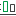

# qlik-cloud-icons
Collection of Qlik Cloud icons in SVG format

|Filename|Preview|
|---|---|
|administration.svg||
|alert.svg||
|analytics.svg||
|app.svg||
|arrow-next.svg||
|arrow-previous.svg||
|assets.svg||
|assistant.svg||
|automation.svg||
|automl-deployment.svg||
|automl-experiment.svg||
|back.svg||
|bookmark.svg||
|browse.svg||
|catalog.svg||
|chart-map.svg||
|chart.svg||
|check.svg||
|collections.svg||
|connection.svg||
|content-security.svg||
|content.svg||
|create.svg||
|csv.svg||
|data-gateway.svg||
|data-integration.svg||
|data-set.svg||
|data-space.svg||
|delete.svg||
|dropdown.svg||
|duplicate.svg||
|edit.svg||
|ellipsis.svg||
|error-fill.svg||
|error-outline.svg||
|events.svg||
|expand.svg||
|extension.svg||
|favorite-fill.svg||
|favorite-outline.svg||
|file.svg||
|filter-fill.svg||
|filter-outline.svg||
|getting-started.svg||
|glossary.svg||
|history.svg||
|home.svg||
|identity-provider.svg||
|info-fill.svg||
|info-outline.svg||
|insight-advisor.svg||
|insights.svg||
|key-driver.svg||
|key.svg||
|knowledge-base.svg||
|link.svg||
|list.svg||
|mail.svg||
|managed-space.svg||
|monitor-views.svg||
|none.svg||
|note.svg||
|notification.svg||
|pin-fill.svg||
|pin-outline.svg||
|project.svg||
|question.svg||
|qvd.svg||
|reduce.svg||
|revoke.svg||
|script-editor.svg||
|search.svg||
|selection-clear.svg||
|selection-next.svg||
|selection-previous.svg||
|selection-tools.svg||
|settings.svg||
|shared-space.svg||
|sheet.svg||
|smart-search.svg||
|sort.svg||
|spaces.svg||
|story.svg||
|success-fill.svg||
|success-outline.svg||
|table.svg||
|theme-outline.svg||
|tiles.svg||
|upload.svg||
|user.svg||
|users.svg||
|warning.svg||
|web.svg||
|webhook.svg||
